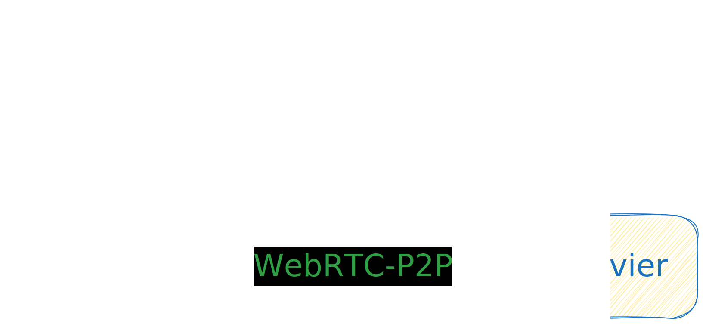

<h1 align="center">
  
  <br>Filegogo<br>
</h1>

<p align="center">
  <a href="https://send.22333.fun">send.22333.fun</a>
</p>

<h4 align="center">A file transfer tool that can be used in the browser webrtc p2p</h4>

<p align="center">
  <a href="https://github.com/a-wing/filegogo/actions">
    
  </a>
  
  <a href="https://goreportcard.com/report/github.com/a-wing/filegogo">
    
  </a>
  <a href="https://github.com/a-wing/filegogo/releases">
    
  </a>
  <a href="https://github.com/a-wing/filegogo/blob/master/LICENSE">
    
  </a>
</p>

[](https://postimg.cc/8jS992hj)

## Deploy on your self server

```bash
docker run -p 8080:8080 ghcr.io/a-wing/filegogo:latest server
```

## Architecture



### Components

- app
  - [x] server
  - [x] webapp
  - [ ] client-cli (current, have many problems)
- lib
  - [ ] libfgg.js (only browser)
  - [ ] libfgg.go
  - [ ] libfgg.rs

## Build && Install

```sh
make
```

## Run Development

### Webapp

```bash
npm install

# frontend
# Default Listen port: 3000
# Auto Proxy port: 8080
npm run dev
```

### Server

```bash

# Default Listen port: 8080
go run ./main.go server
```

### Client

> run cli client. For example:

```bash
# send command
go run ./main.go send -s http://localhost:8080/6666 <file>

# recv command
go run ./main.go recv -s http://localhost:8080/6666 <file>
```

## Config

[Reference iceServer config](https://developer.mozilla.org/en-US/docs/Web/API/RTCIceServer)

### Built-in turn server

```toml
# Enable Built-in turn server
[turn]

# if no set, use random user
user = "filegogo:filegogo"

realm = "filegogo"
listen = "0.0.0.0:3478"

# Public ip
# if aws, aliyun
publicIP = "0.0.0.0"
relayMinPort = 49160
relayMaxPort = 49200
```

### iceServer Use Other

For example: [coturn](https://github.com/coturn/coturn)

#### Docker Deployment Coturn

```bash
docker run -d --network=host --name=coturn coturn/coturn:alpine \
           -n --log-file=stdout \
           --min-port=49160 --max-port=49200 \
           --lt-cred-mech --fingerprint \
           --no-multicast-peers --no-cli \
           --no-tlsv1 --no-tlsv1_1 \
           --realm=filegogo \
           --user=filegogo:filegogo \
           --external-ip='$(detect-external-ip)' \
           --relay-ip='$(detect-external-ip)' \
           --listening-ip='$(detect-external-ip)' \
           --listening-device=eth0
```

Test Deployment

```bash
# Test stun
turnutils_stunclient cn.22333.fun
turnutils_stunclient stun.22333.fun

# Test turn
turnutils_uclient -u filegogo -w filegogo -y cn.22333.fun
turnutils_uclient -u filegogo -w filegogo -y turn.22333.fun
```

#### Package Manager Deployment

```sh
apt install coturn
```

```ini
# /etc/turnserver.conf

listening-ip={YOUR_IP_ADDRESS}
relay-ip={YOUR_IP_ADDRESS}

# Public ip
# if aws, aliyun
external-ip={YOUR_IP_ADDRESS}

fingerprint
lt-cred-mech
user=filegogo:filegogo
realm=filegogo

```

## Acknowledgments

- [pion](https://github.com/pion/webrtc)
- [croc](https://github.com/schollz/croc)
- [firefox-send](https://github.com/mozilla/send)
- [ffsend](https://github.com/timvisee/ffsend)

