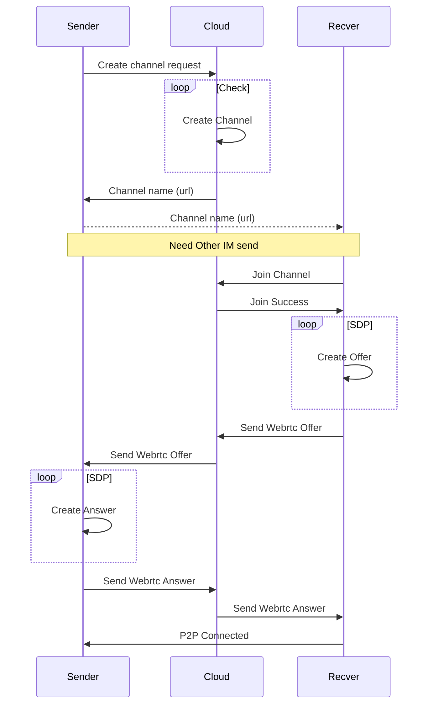

# Architecture

```mermaid
sequenceDiagram

Sender ->> Cloud: Create channel request
loop Check
    Cloud ->> Cloud: Create Channel
end
Cloud ->> Sender: Channel name (url)

Sender -->> Recver: Channel name (url)
Note over Sender, Recver: Need Other IM send

Recver ->> Cloud: Join Channel
Cloud ->> Recver: Join Success
loop SDP
    Recver ->> Recver: Create Offer
end
Recver ->> Cloud: Send Webrtc Offer

Cloud ->> Sender: Send Webrtc Offer
loop SDP
    Sender ->> Sender: Create Answer
end
Sender ->> Cloud: Send Webrtc Answer

Cloud ->> Recver: Send Webrtc Answer
Recver ->> Sender: P2P Connected
```

